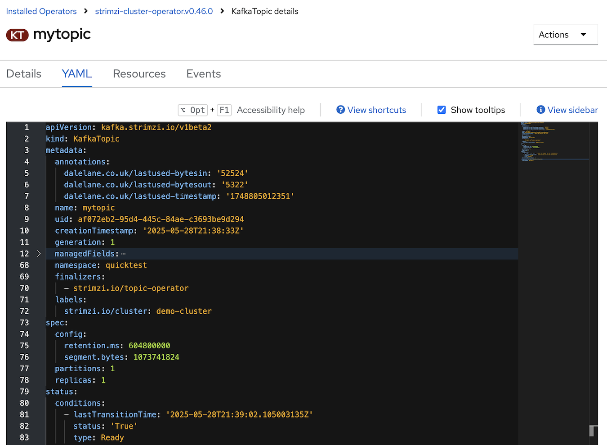
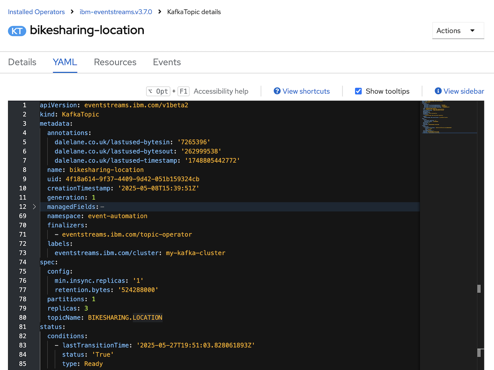
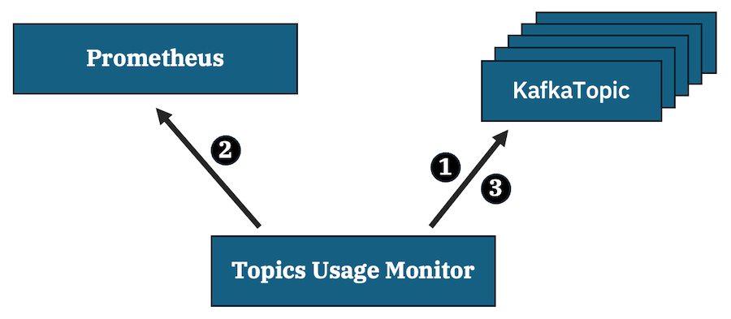
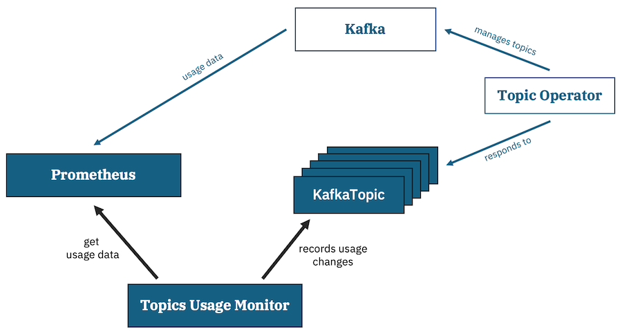

# Kafka Topics Usage Monitor

**Proof of concept for an automated system that records the time that a Kafka topic was last used by a Kafka consumer or Kafka producer in an annotation in the Kubernetes `KafkaTopic` operand representing the topic.**

## Examples

Examples interpreting the annotation using [the `check-usage.sh` script](./scripts/check-usage.sh)

---

A **Strimzi** topic where consumer or producer traffic was last observed at 7.10pm on 1st June 2025 GMT

```sh
% ./scripts/check-usage.sh mytopic
mytopic last used at 2025-06-01 20:10:12
```



---

An **Event Streams** topic where consumer or producer traffic was last observed at 7.17pm on 1st June 2025 GMT

```sh
% ./scripts/check-usage.sh bikesharing-location
bikesharing-location last used at 2025-06-01 20:17:22
```




## Pre-requisites

This PoC assumes that you are running your Kafka cluster in Kubernetes, using either the [Strimzi Kafka Operator](https://strimzi.io/) or [IBM Event Streams](https://www.ibm.com/products/event-automation/event-streams).

## Overview



For each topic, the Topics Usage Monitor:

1. **Read from Kubernetes:** Retrieves the topic annotations with the usage info that was stored the last time the Monitor checked
2. **Read from Prometheus:** Queries Prometheus for the latest usage info
3. **Write changes to Kubernetes:** Updates the annotations - only if the usage info has changed since the values retrieved in (1)

The annotations include a timestamp for the Prometheus data so it is easy to know when the usage info has last changed.

### Context

To put this in a little context, remember that:



`KafkaTopic` Kubernetes resources are definitions of Kafka topics that the Strimzi / Event Streams Topic Operator manages in the Kafka cluster.

Kafka metrics can be collected in Prometheus, where it can be used to visualise usage (e.g. Grafana dashboards) or to trigger alerts.


## Running the Monitor

### Strimzi

[`deploy/strimzi.yaml`](./deploy/strimzi.yaml) contains example YAML for deploying the Topics Usage Monitor to keep track of the last time that consumer or producer traffic have been observed for each topic in a Strimzi Kafka cluster.

This is an example of how to run the Monitor in a namespace called `quicktest` in a Red Hat OpenShift Container Platform cluster.

Running it in a different namespace or K8s distribution will require some minor changes.

An example Strimzi Kafka cluster with the necessary metrics collection configuration for this sample deployment can be found in [`demo-kafka-cluster.yaml`](./demo-kafka-cluster.yaml)

### IBM Event Streams

[`deploy/ibm-event-streams.yaml`](./deploy/ibm-event-streams.yaml) contains example YAML for deploying the Topics Usage Monitor to keep track of the last time that consumer or producer traffic have been observed for each topic in an IBM Event Streams Kafka cluster.

This is an example of how to run the Monitor in a namespace called `event-automation` in a Red Hat OpenShift Container Platform cluster.

Running it in a different namespace or K8s distribution will require some minor changes.

An example Event Streams Kafka cluster with the necessary metrics collection configuration for this sample deployment can be found at https://github.com/IBM/event-automation-demo

### Configuration

Configuration for the Monitor is provided through environment variables.

|                    | **default**                                            | **notes** |
| ------------------ | ------------------------------------------------------ | --------- |
| `NAMESPACE`        |                                                        | Kubernetes namespace where the Kafka cluster is running |
| `CLUSTER`          |                                                        | Name of the Kafka cluster |
| `LOG_LEVEL`        |                                                        | trace / debug / info / warn / error / off |
| `MODE`             | `strimzi`                                              | Whether to monitor a Strimzi cluster (`strimzi`) or an Event Streams cluster (`eventstreams`) |
| `BYTES_IN_METRIC`  | `kafka_server_brokertopicmetrics_bytesin_total`        | Metric to use to identify per-topic bytes in |
| `BYTES_OUT_METRIC` | `kafka_server_brokertopicmetrics_bytesout_total`       | Metric to use to identify per-topic bytes out |
| `PROMETHEUS_URL`   | `https://thanos-querier.openshift-monitoring.svc:9091` | URL for querying Prometheus |
| `POLL_INTERVAL_SECONDS` | `3600` (1 hour)                                   | How frequently to poll Prometheus for new metrics data |

